# STM32 的初体验

从本节开始，暂时使用 Keil 5 进行讲解，VS Code 多处地方同理。

## 创建项目
点击顶栏 `Project` -> `New μVision Project..` 即可创建新项目。

首先会提示我们要将项目文件放在哪，建议新建一个空文件夹即可，然后保存。

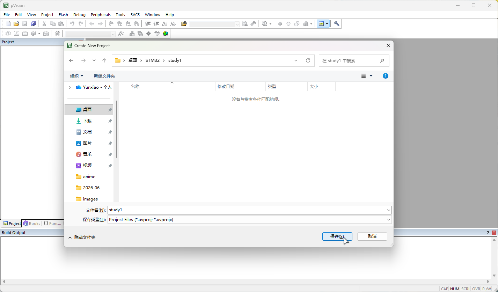

下一部选择设备类型，这里就显示了我们刚安装的扩展包。此处我们需要依次选择 `STMicroelectronics` -> `STM32F1 Series` -> `STM32F103` -> `STM32F103C8`，点击“OK”按钮确定。

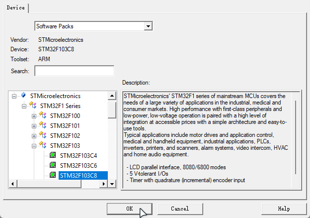

::: tip
如果你看到左下角菜单里只有“ARM”而没有“STMicroelectronics”，那么很可能是扩展包没有安装好，[回到上一节](./preparation#安装扩展包)重新安装一下安装扩展包吧~
:::

然后会跳出一个“Manage Run-Time Environment”的窗口，它可以在后续为我们快速初始化一个工程，但现在我们还暂时不需要，先叉掉。

至此，你的 STM32 开发工程已经创建完毕！

## 初始化项目
虽然已经创建了工程，但其实它还处于暂不可用的状态，我们需要为它从上一节里下载的“标准外设库”添加一些必需的文件。

### 复制必需文件

解压标准外设库，进入 `Libraries` -> `CMSIS` -> `CM3` -> `DeviceSupport` -> `ST` -> `STM32F10x` -> `startup` -> `arm` 目录，其中的所有内容，就是 STM32 的启动文件。

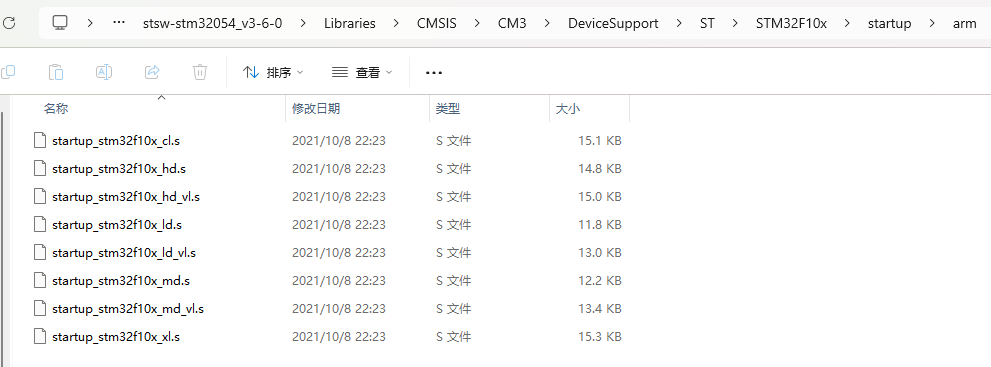

打开刚才我们创建工程的空文件夹，里面已经自动生成了一些东西了。现在我们再创建一个文件夹名为 Start，将这些启动文件全部复制到 Start 文件夹内。

然后退回到 `STM32F10x` 目录，将这 3 个文件也复制过去。它们的作用分别是描述 STM32 的寄存器及其地址，以及时钟频率相关。

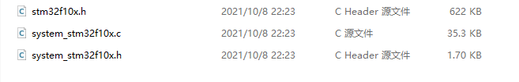

然后再退回到 `CM3` 目录，进入 `CoreSupport` 文件夹，里面是 ARM Cortex 内核的寄存器描述相关文件，将这 2 个文件也复制过去。

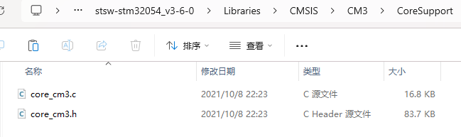

### 添加必需文件

全部复制后，现在回到 Keil 5 中，以将刚刚复制的内容添加到我们的 STM32 工程里。修改左侧 Project 栏里的“Source Group 1”为“Start”或其它你能认得懂的名称。

右键它，选择 `Add Existing Files to Group 'Start'...`。进入 Start 目录，底部“文件类型”改为“All files”，选中所有的 `.c` 和 `.h` 文件。

然后再选择启动文件。

完成，我们需要的文件就添加完毕了！可能部分同学的文件上会出现钥匙图标，这表示该文件只读，但我们也不会对这些文件进行修改，所以无需过于注意。

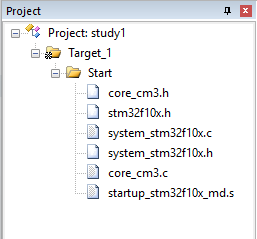

接下来，我们要将头文件添加进 Keil 的 include 路径里。点击左上角魔法棒图标，选择“C/C++ (AC6)”，点击下方“Include Paths”右侧的 <kbd>...</kbd> 按钮。

然后会打开“Folder Setup”窗口，点击右上角的虚线图标按钮以新建 include 路径，此时下方会多出一行。点击这一行末尾的 <kbd>...</kbd> 按钮，即可选择要添加哪个文件夹到 include 路径。此处我们**一定要先进入** Start 文件夹后，再选择。

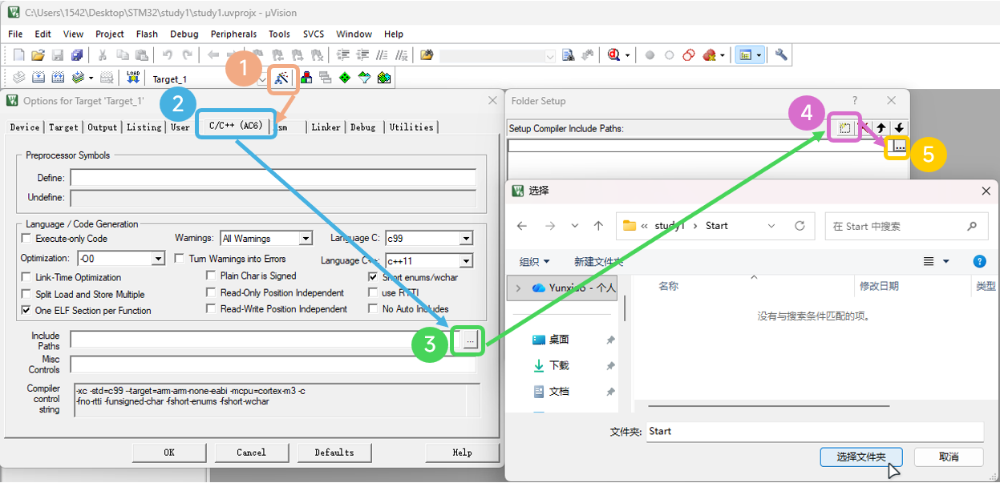

选择完成后，点击 OK 以完成配置。至此，初始化结束。

## Hello, World!
现在，回到左侧 Project 栏，右键“Target_1”选择 `Add Group`，修改新建的组的名字为“User”，以后我们写的 main 函数之类的代码就存放再这里面。然后再右键“User”，选择 `Add New Item to Group 'User'`，会弹出一个新建文件的窗口。

选择“C File”，填写文件名 main，然后**一定要**点击“Location”栏最右侧的 <kbd>...</kbd> 按钮，选择刚才我们添加的 User 文件夹！否则，会直接创建在项目的根目录。

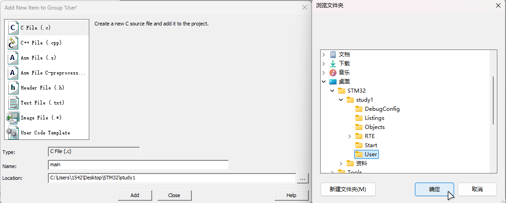

现在，在 main.c 文件里写一个最简单的点灯程序吧！

```C
#include "stm32f10x.h"                  // Device header

int main(){
	RCC->APB2ENR = 0x00000010;
	GPIOC->CRH = 0x00300000;
	GPIOC->ODR = 0x00000000;

	while(1){}
}

```
在当前阶段我们暂时不需要理解它的意思。点击左上角的编译按钮，如果下方控制台输出 `0 Error(s), 0 Warning(s)`，说明我们的第一个 STM32 程序终于编译出来了！

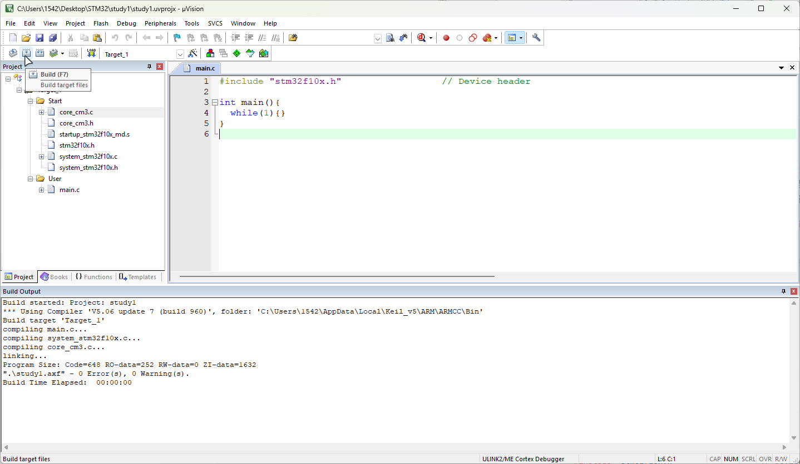

## 写入到 STM32
程序编译完成，我们需要通过调试功能向板子内“下载”程序。

首先，点击魔法棒图标，选择“Debug”栏，打开右上角的下拉菜单以选择连接到 STM32 板子的调试器。如果你使用的是 DAP，那么选择 `CMSIS-DAP`，ST-Link 则选择 `ST-Link` 项，其它的则按照你的设备的说明进行选择。

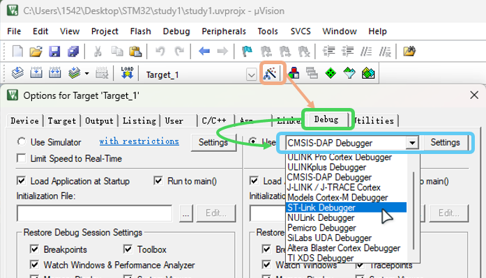

然后点击右侧的“Settings”按钮，在打开的新窗口中进入“Flash Download”一栏，将 `Reset and Run` 选项打勾，这样，每次下载程序之前就会先重置 STM32，避免不必要的麻烦了。

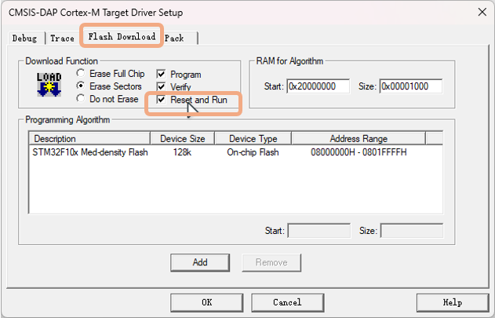

## 下载程序
程序编译完成并设置好 Keil 5 软件后，我们就可以开始正式刷写程序了。点击左上角的下载图标，即可将程序下载至 STM32 了！

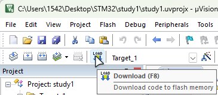

如果看见常亮的电源指示灯旁，亮起了一个颜色不一样的灯，那么恭喜你，完成了嵌入式里的 Hello World！

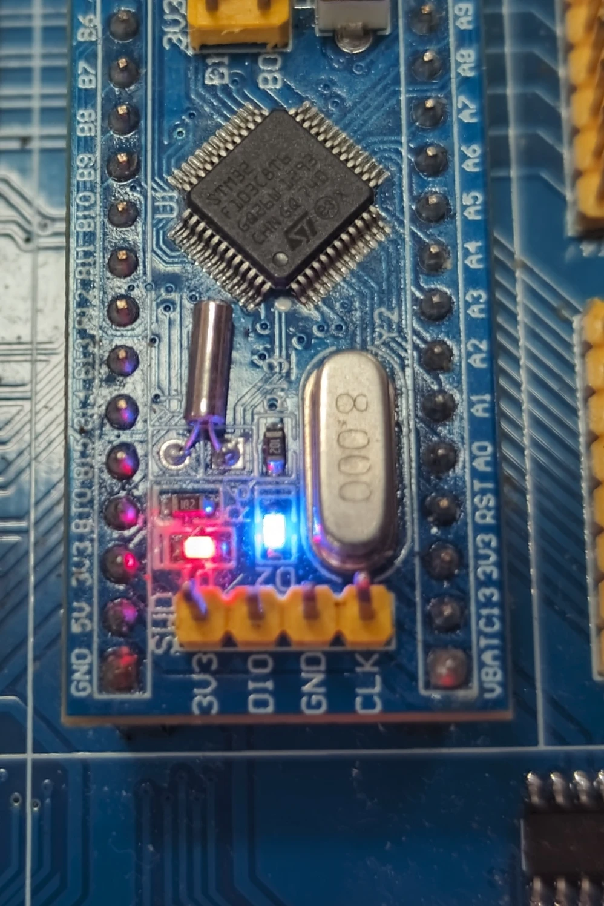