# 准备工作

本节主要介绍如何搭建 STM32 的开发环境，对几乎所有 STM32 芯片都适用，可放心食用。

## 硬件
由于 STM32 芯片有上百种型号，此处笔者使用自己手上~~从学长那里传下来的仅有的~~ STM32F103C8T6 做示范。该芯片运行速度为 72Mhz，RAM 为 20KB，ROM 为 64KB，是当前市面上 STM32 系列芯片里最常见的之一，非常容易在各品牌的开发板上看到。

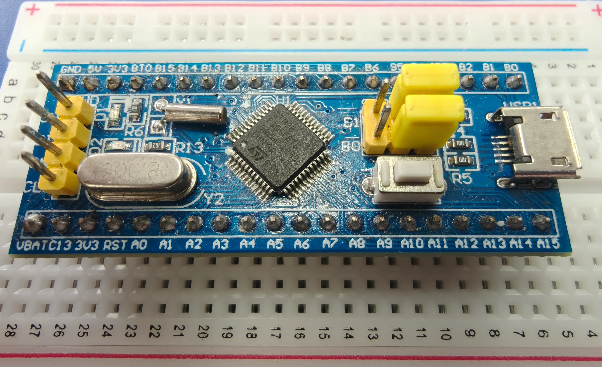

一般情况下，我们通过 DAP（或仿真器）或者 ST-Link，将 STM32 开发板或核心板与电脑连接。

首先，使用母对母杜邦线（即线的两侧都是 4 个插孔）分别按次序插入板子上的 4 处插针，然后将 DAP 或 ST-Link 连接到电脑，并且正确安装驱动。

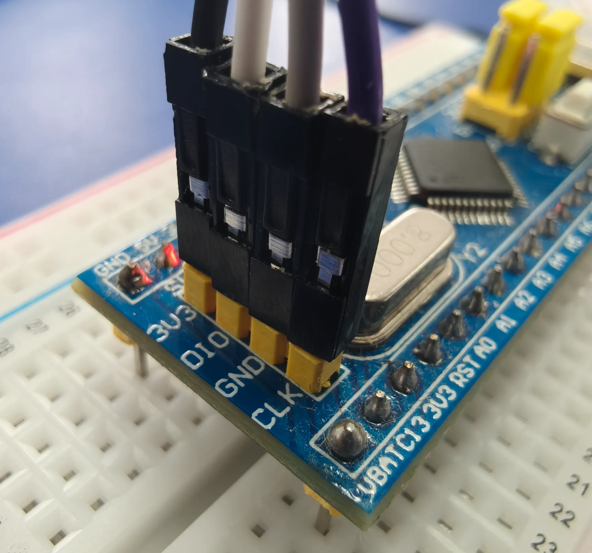

记下每一根线对应的定义，一般情况下每个板子都是 3V3、DIO、GND 和 DCLK。然后确定 DAP 或 ST-Link 上引脚的定义，将杜邦线另一端的每根线一一对应地插进对应的插针。

这样就算与电脑连接好了，可以开始我们的嵌入式开发工作了。本文档介绍了 Keil 5 和 VS Code 两种开发工具，各位可以自行选择。

## 下载和激活 Keil 5
Keil 5 是全球使用最广泛的嵌入式系统的 C / C++ 开发环境，当前，许多嵌入式的教学视频或文档也是基于 Keil 5 制作的。对于新手，我们也推荐使用 Keil 5 去快速熟悉 STM32 单片机的开发流程。

官网地址：https://www.keil.com/demo/eval/arm.htm

注意，从官网下载还需要瞎填很多信息和自己的邮箱，再从发到邮箱的链接进行下载。如果想要图省事，可通过以下链接获取。

（注：以下提供的内容，版本号均为 5.43.1.0，SHA-256 校验 `5702ed2093680932da3466134885b2141297099df106e5090c38f65a9510b7ca`）

**MDK543a.exe**

- [官方 Azure CDN](https://armkeil.blob.core.windows.net/eval/MDK543a.exe)
- [豆包网盘](https://p0-fsb.api.crrashh.com/u/1001000085)
- [123 云盘](https://1812070911.share.123pan.cn/123pan/oYprVv-usfrv)

下载后以管理员身份运行安装程序。

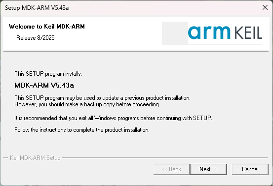

一路 Next 安装完成后，打开软件就是这样。

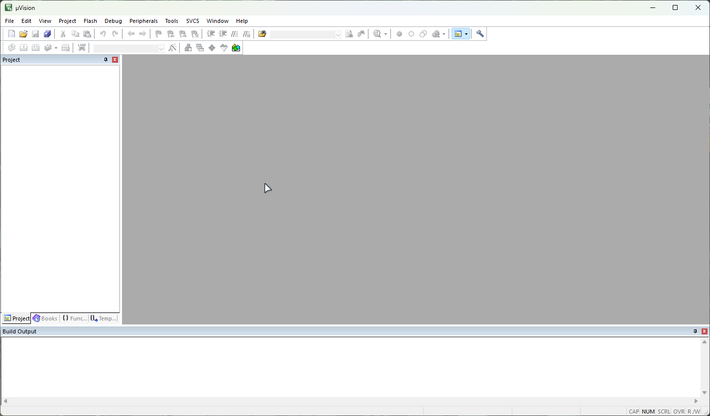

由于 Keil 5 是商业软件，授权费用极高，而免费试用版的很多功能会受到限制，所以我们需要第三方注册机来激活它。~~说白了就是盗版和破解嘛。~~ 

**Keil注册机.exe**
- [蓝奏云盘](https://wwa.lanzouu.com/i19fq3ri1kfa)
- [123 云盘](https://1812070911.share.123pan.cn/123pan/oYprVv-usfrv)

下载后，在 Keil 5 中点击 `File` -> `License Management...`

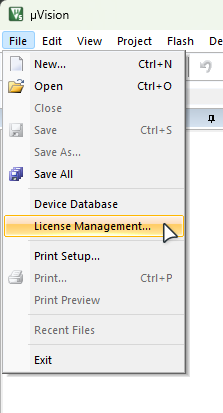

然后启动注册机程序（此处会有一阵强劲的音乐响起），将 Keil 5 中的 Computer ID 复制到注册机程序里。打开注册机的“Target”下拉菜单，选择“ARM”，然后点击最下方的“Generate”按钮，即可生成注册码。将注册码复制粘贴到 Keil 5 下方的窗口中，点击“Add LIC”按钮即可激活了。

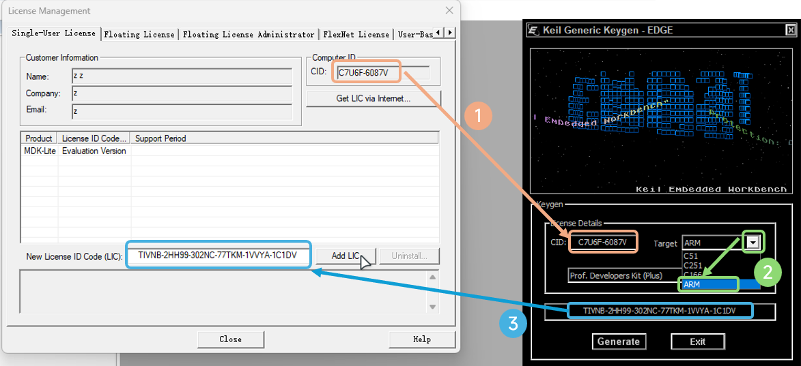

像下图中这样，显示 `LIC Added Successfully`，且 Product 处变为 `MDK-ARM Plus`，即激活完毕。

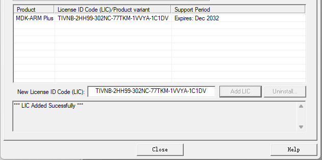

## 安装扩展包
为了适配不断新出现的芯片，Keil 5 开始不再内置对芯片的支持，也就是说现在我们只得到了一个特别的 C / C++ IDE。如果要开发 STM32，则需要下载并安装扩展包才可继续。

官网地址：https://www.keil.arm.com/packs/stm32f1xx_dfp-keil/versions/

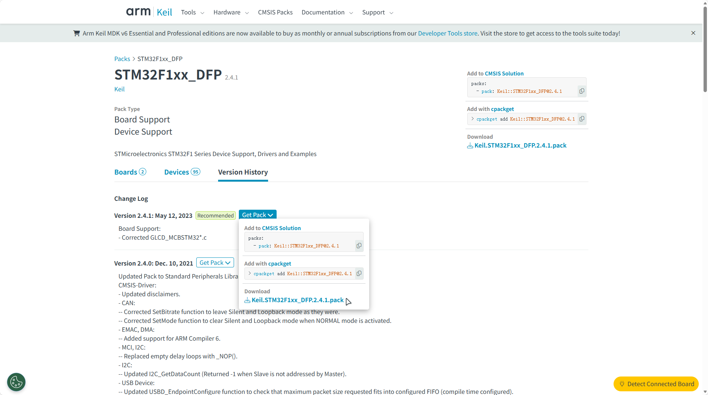

进入官网，鼠标移上“Get Packs”按钮，在下拉的面板里点击 `.pack` 后缀结尾的链接。觉得麻烦可以直接下载以下链接。

**Keil.STM32F1xx_DFP.2.4.1.pack**

- [官方 Azure CDN](https://keilpack.azureedge.net/pack/Keil.STM32F1xx_DFP.2.4.1.pack)
- [蓝奏云盘（需解压）](https://wwa.lanzouu.com/iN3eG3ri664f)
- [123 云盘](https://1812070911.share.123pan.cn/123pan/oYprVv-usfrv)

双击下载的 .pack 文件，点击“Next”，即可开始安装。

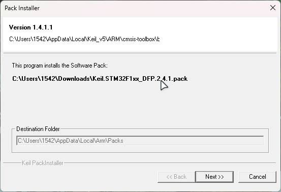

## 安装标准外设库
此外，只是 IDE 有了扩展包支持还不够，为了能够控制芯片按我们要求执行任务，还需要下载“标准外设库”。

官网地址：https://www.st.com.cn/zh/embedded-software/stm32-standard-peripheral-libraries.html

此处列举了不同的 STM32 芯片系列，由于我们的芯片是 STM32F103C8T6，所以选择 F1。

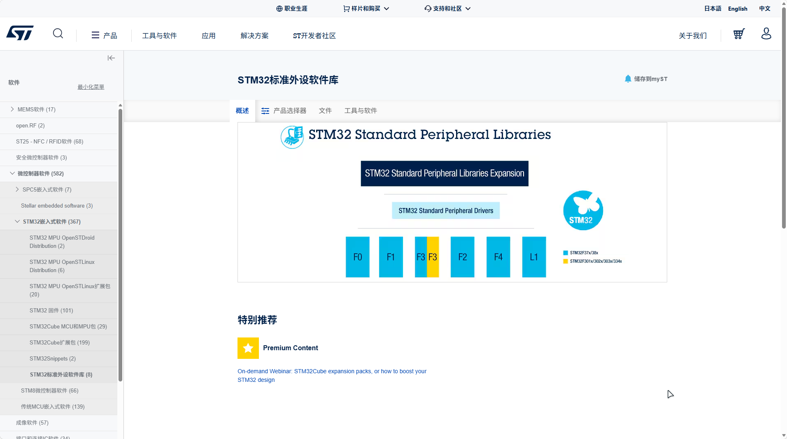

来到这个页面，点击“获取最新版本”。注意，从官网下载还需要瞎填很多信息和自己的邮箱，再从发到邮箱的链接进行下载。如果想要图省事，可通过以下链接获取。

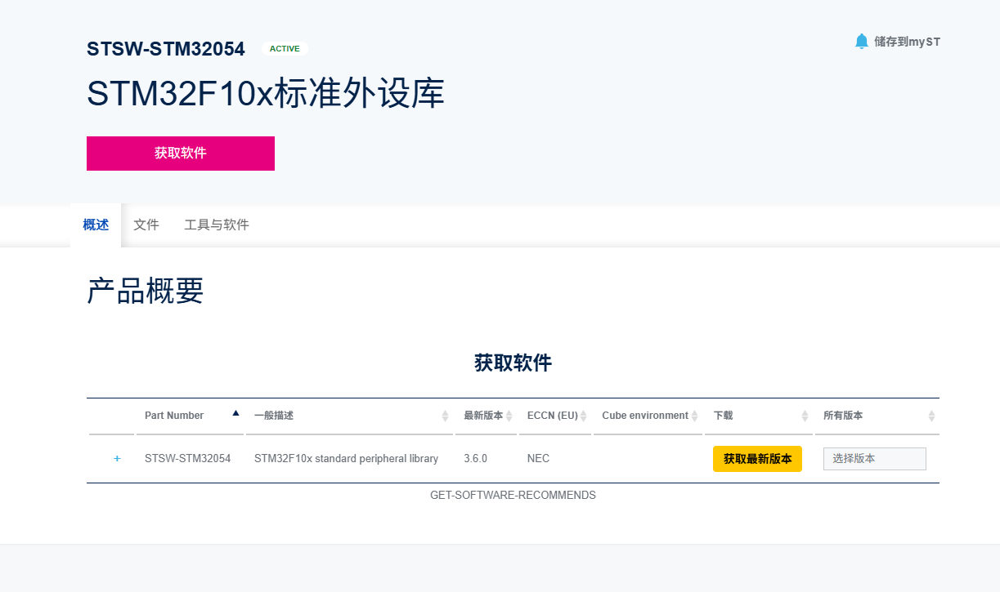

**stsw-stm32054_v3-6-0.zip**

- [豆包网盘](https://p0-fsb.api.crrashh.com/u/1001000086)
- [蓝奏云盘](https://wwa.lanzouu.com/iKpZu3ri7f9a)
- [123 云盘](https://1812070911.share.123pan.cn/123pan/oYprVv-usfrv)

下载完成后，解压到一个目录里，就算大功告成啦！
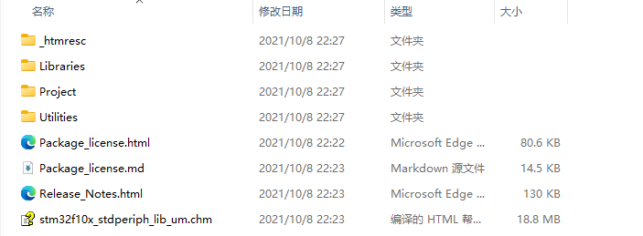

## 安装旧版本编译器
由于现在版本的 Keil 5 只提供 v6 版本的编译器，而我们 start 库里的代码只支持 v5 版本的编译器，所以需要额外下载旧版编译器并添加到 Keil 软件里。

官网地址：https://developer.arm.com/downloads/view/ACOMP5

注意，进入下载页面时要**看标题是 Win32**！不要下载到 Lin32 的 Linux 版本了。

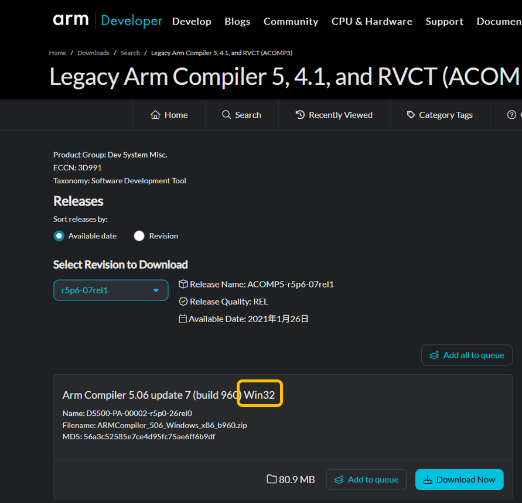

下载安装，记下旧版本编译器的安装路径，安装完成后打开此路径。右键桌面的 Keil 5 软件图标，选择“打开文件所在的位置”，此时你在 Keil 5 安装路径的“UV4”文件夹内。退回到上一级，进入 ARM 文件夹，在里面**创建一个文件夹名为“ARMCC”**。将旧版本编译器的所有文件复制到 ARMCC 文件夹内。

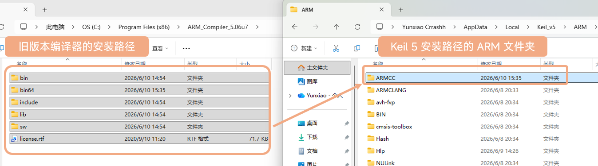

由于下载必须注册 ARM 网站的账号，我们打包了现成的编译器文件，无需安装，直接解压即可用于复制。

**ARM_Compiler_5.06u7.zip**

- [豆包网盘](https://p0-fsb.api.crrashh.com/u/1001000087)
- [蓝奏云盘](https://wwa.lanzouu.com/iKpZu3ri7f9a)
- [123 云盘](https://1812070911.share.123pan.cn/123pan/oYprVv-usfrv)

打开 Keil 5 软件，点击魔法棒右边的按钮，选择“Folders/Extensions”一栏，点击“Use ARM Compiler”一栏右侧的 <kbd>...</kbd> 按钮，在新的窗口中点击“Add another ARM Compiler Version to List...”，选择我们刚刚复制完的 ARMCC 文件夹，确定。

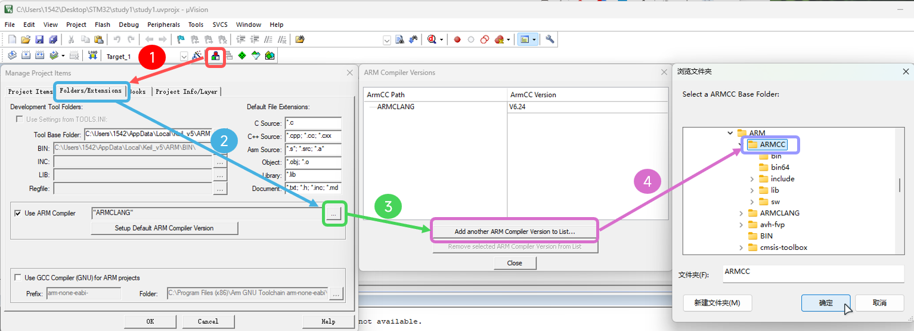

然后再点击魔法棒，选择“Target”一栏，打开“ARM Compiler”的下拉菜单，选择 v5 版本的编辑器，确定。

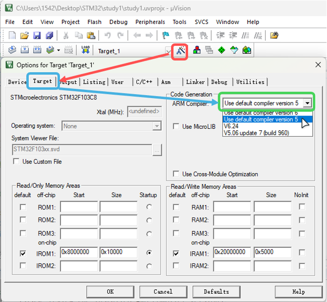

恭喜，你已经完成了 Keil 5 软件的初始化！

## VSCode
施工中......
