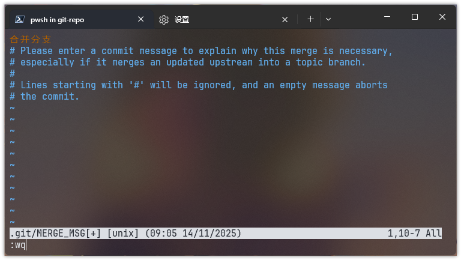
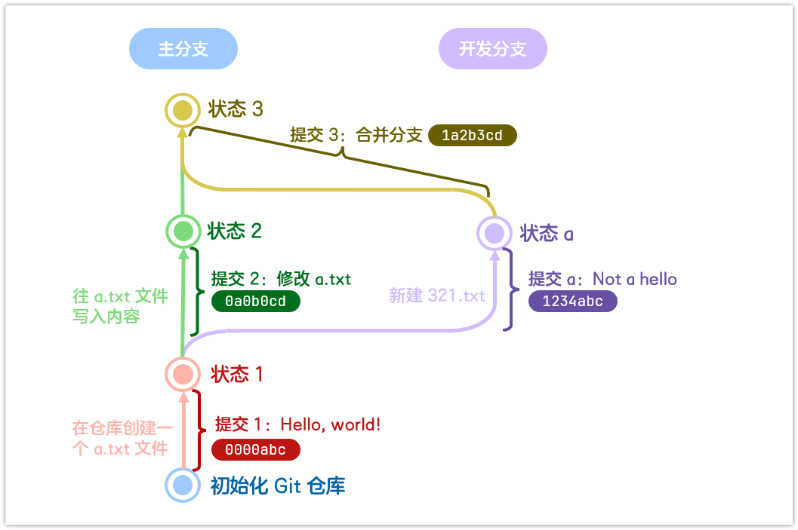

# 分支

## 分支为何物？
举个栗子，你是某茄某点某横某江的小说家，你的热门小说即将连载下一章并且已经写好了初稿。但是你转念一想：如果换一个桥段会不会更好一点呢？读者会不会更容易接受呢？于是聪明的你从原稿件的某个时间点开始，接着此前的剧情开启了另一条 if 线，然后顺利地接回了主线剧情。

Git 中的分支（branch）就是此般存在。在团队协作中，主分支多用于存放较稳定的代码，而**处于开发中的部分一般需要单独创建一个分支**，等到完成度较高了再合并进入主分支。

## 开一个新分支
书接上回，你退回了状态 1，但它也是主分支上的一个提交，接下来就用 `git checkout` 指令从这里单独开一个名为 `dev` 的开发分支吧。
```shell
git checkout -b dev
```
*注：创建新的不存在的分支，需带上* `-b` *参数。*

执行完这一步，Git 不但会创建分支，还会自动进入这个新的分支。你现在的状态应该是这样的 ↓


那么，做点不同于主分支上的更改吧！比如创建另外一个 321.txt 如何呢？
```shell
git add 321.txt
git commit -m "Not a hello"
```
这样一来，我们就在新分支创建了一个完全不同的新提交！


对了之前说到的怎么会到原来的分支的问题还没解决呢，现在我们先回到原分支吧。如果[安装的时候](./index#windows-用户)默认分支名没有自定义的话，主分支应该是 `master`。
```shell
git checkout master
```
平稳落地！顺利回到主分支！

## 合并分支
接下来使用 `merge` 指令合并（merge）我们在 `dev` 分支上的提交吧~
```shell
git merge dev
```
你信心满满地按下回车，然后——


嗯？嗯嗯？这是什么！？

记得你[安装的时候](./index#windows-用户)选择的文本编辑器吗？这就是几乎纯键盘交互的文本编辑器 Vim！

回到这里，白色横条之上就是当前编辑的文档的内容，即合并消息。怎么编辑它呢？按住键盘上的 <kbd>I</kbd> 键即可进入编辑模式，然后你就可以按键盘的上下左右键移动光标当普通文本编辑器使用啦。带 # 号的内容就是合并消息的注释，不会被 Git 读取；而以 ~ 开头都是不存在的空行。

由于合并也是一种特殊的提交，这里写的合并消息跟你 `git commit -m` 里写的提交消息相当于一个东西。写完之后按 <kbd>Esc</kbd> 即可退出编辑模式。

但是！怎么保存呢？按 <kbd>:</kbd> 键进入命令模式，输入 `wq`，回车执行命令，即可保存并退出了。


恭喜合并顺利结束！现在你的项目应该已经变成这个状态了 ↓


## 合并后还要干嘛？
不过！少侠请留步——合并完分支之后，我们创建的开发分支并不会被销毁。如果需要删掉这个分支，需要执行：
```shell
git branch -D dev
```
如果需要继续在开发分支上开发新的东西，也可以用 `checkout` 回到开发分支。