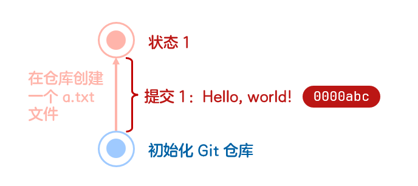
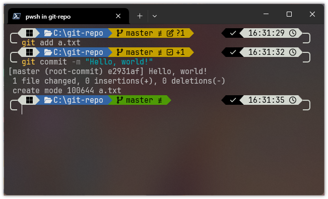
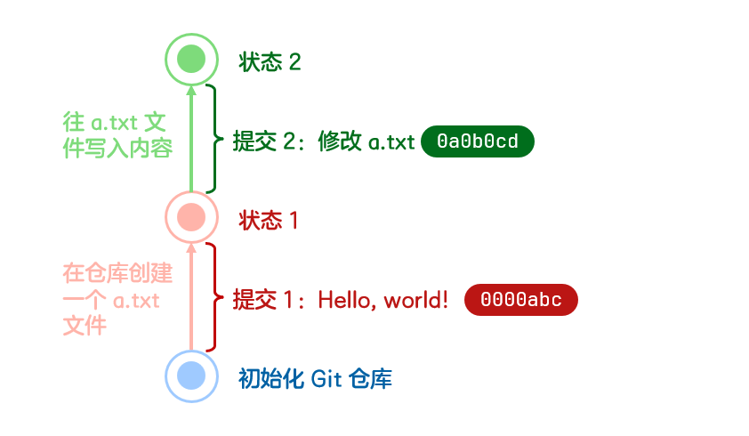

# 提交

## 什么是提交？
假如你正在 coding，每做出一个阶段的更改，你就希望保存一个小版本，这样你以后可以回头查看这个版本我在这个版本做了什么修改、这个修改在代码层面是怎么完成的。

那么 Git 的提交（commit）就是干这个的——它能为你**记录某个时间点所有的文件变化**，包括新增、修改、删除等，相当于你在做出修改后为项目拍的一张“快照”。

举个栗子，现在我在初始化好的仓库里新建了一个文件 a.txt，那么我们就可以创建一个提交以保存此更改。


其中，“添加 a.txt”就是我们给这个提交设定的消息（暂且可以看成一个名称），当然你高兴也可以不这么写，毕竟只是个消息，像“Hello, world!”之类的也不是不行。


#### 那么，如何操作呢？
首先需要告诉 Git 哪些更改需要被提交，这个操作叫做“暂存”，在后面我们会学习到。如果新建或者修改了文件，就用 `add` 命令，被重命名或移动了则使用 `mv`，被删除了则用 `rm`。这里我们新建了文件，就这样：
```shell
git add a.txt
```
这样我们就让 Git 知道了：哦~你新建了一个 a.txt 文件。接下来，就把它提交吧。
```shell
git commit -m "Hello, world!"
```
不出意外的话，你的第一个提交就这样创建好了！

*注：此处方括号里的* `e2931af` *就是该提交的哈希。*

## 什么是哈希？
敏锐且聪明且智慧的你可能会发现：明明这上面两个提交做的是同一件事，但为什么右边深色框框里的代码内容不一样呢？

其实这就是提交的哈希值（hash）——通过 SHA-1 算法生成的 40 位的 **16 进制数字**，而一般使用只取其前 7 位。但由于计算要素包含消息、时间、作者等多个内容，几乎可以将其看作为随机生成的。

提交的哈希不同于消息，一个仓库可以存在多个同消息提交，但**每一个提交的哈希必须是唯一的**，作为该提交的唯一标识。换句话说，Git 要想找到一个提交，那么只能从哈希找而不是消息。

:::tip 小测验
以下是一个提交的信息，你能判断出 Git 要想找到它要依靠什么吗？
```
commit e2931afd303460aaf0d12ca1e9fdc2f28fda04e5 (HEAD -> master)
Author: crrashh1542 <1542@crrashh.com>
Date:   Wed Nov 12 16:31:34 2025 +0800

    Hello, world!
```
:::

## 提交有啥用？
完成一次提交之后，你就有了一个“**历史状态**”，你可以随时回到这个提交的状态，查看代码的修改情况，查看项目当时的状态，甚至恢复到那个版本，这让开发过程安全、可追溯。

举个栗子，你创建 a.txt 之后又往里面写了点内容，然后你 `git add` 并 `git commit` 又一顿输出搓了第二个提交。


欸欸欸，你说“能随时回到这个提交的状态”，是真的吗？

当然！只要用 `checkout` 找到这个提交，就能回去啦！
```shell
git checkout 0000abc（实践时将其改为第一个提交的哈希）
```
这个时候再打开 a.txt，是不是很神奇？你刚才写进去的东西没了！Get！时空回溯能力已掌握！

但是，怎么回去呢？！！

——且听下回分解！（笑）