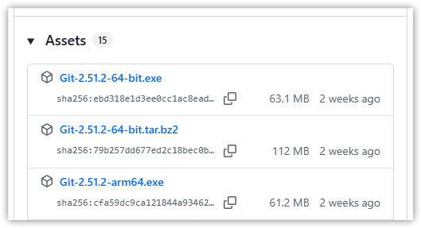
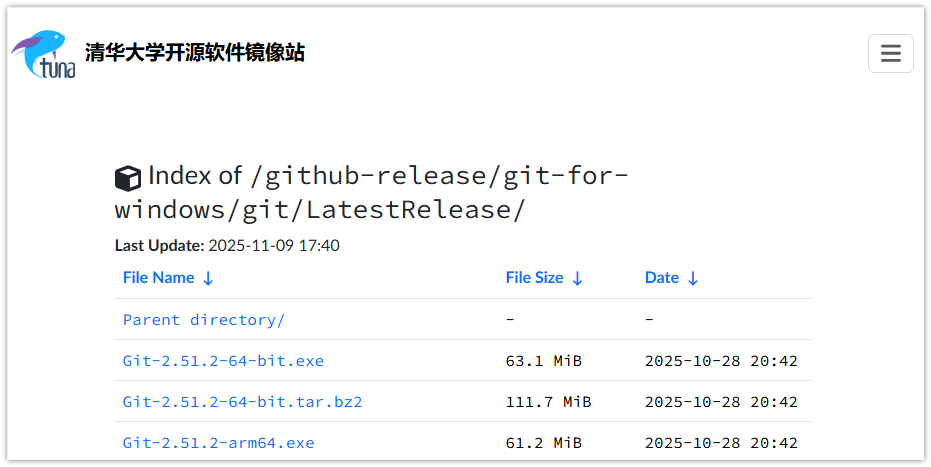
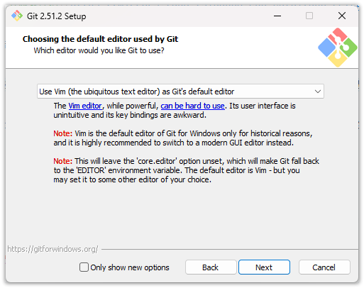
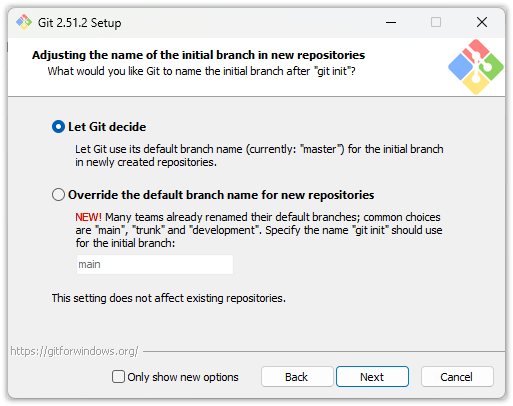
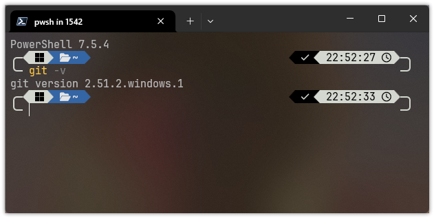
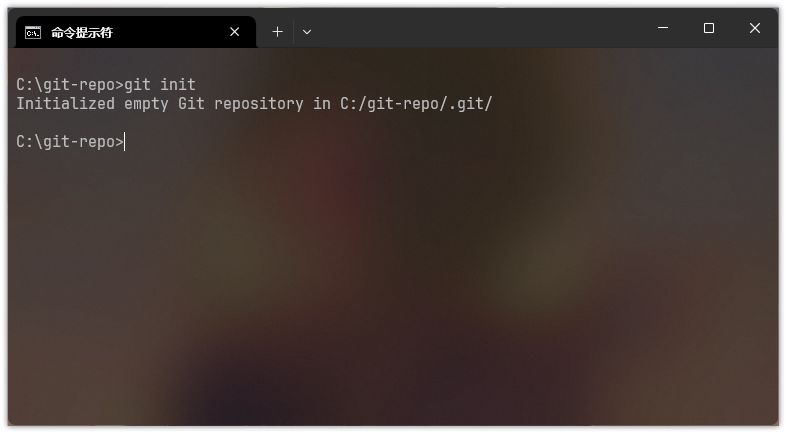

# Git 的初体验

## Git 有何用？
在酣畅淋漓的 coding 后，是不是觉得手动总结改动很麻烦？想删除一些代码，但害怕以后如果需要找不回来怎么办？在修改的代码出 bug 后，是不是发现撤销到以前的版本很麻烦？在团队合作的时候，是不是发现合并他人的代码很麻烦？

痛！太痛了！如果有一个东东，不但能**自动记录**我每次对项目做了些啥，同时可以方便**他人协同** coding，这样自己就不用管这些琐事了！

太巧了！这也是“版本控制”系统想解决的问题！好消息是，现在，你的面前就是最先进的分布式版本控制系统——Git！

## Git 怎么安装？
### Windows 用户
打开 Git for Windows 的官方 GitHub 发布页面：[Releases · git-for-windows/git](https://github.com/git-for-windows/git/releases/latest)，打开 Assets 列表，按照你电脑 CPU 架构下载 `Git-版本号-架构.exe` 文件即可。



对于网络连接不方便的同学，也可以打开 [清华大学开源软件站](https://mirrors.tuna.tsinghua.edu.cn/github-release/git-for-windows/git/LatestRelease/) 下载。


下载完成后，打开程序安装，一般直接一路按照默认选项点“Next”即可。

点击 2 下“Next”后你应该会看到这个界面，这是选择在一些 Git 操作中，用什么给当文本编辑器，默认为 Vim，你开心也可以选别的，比如 VS Code 甚至 Windows 自带的记事本。

*（注：Vim 是 Linux 里常用的运行在终端里的文本编辑器，是 T0 级别的强大，对新手较不友好；Git 自带的 MinGW64 环境中也包含它，后续演示也以 Vim 为准）*

再点下“Next”会出现这个界面，这是询问默认 Git [分支](./branch)的名称，默认为 `master`，你喜欢别的也可以选择下方选项进行自定义。


### macOS 用户
先安装完 Homebrew 后，再在终端执行：
```shell
brew install git
```

### Linux 用户
在终端使用系统的包管理器进行安装即可。~~（虽然但是你都用 Linux 系统了也该会装 Git 吧）~~

### 检验安装是否完成
在终端输入 `git -v`，如果正确输出了版本号，那么恭喜你安装成功！


## Git 怎么配置？
由于 Git 是分布式的，即每个人的设备上都会存储一个完整的版本库（即 Git 仓库），我们需要配置自己的用户名和邮箱作为个人标识。

依旧在终端，将用户名和电子邮箱替换为自己的，输入以下指令：
```shell
git config --global user.name "用户名"
git config --global user.email "电子邮箱"
```
（注：由于后续需要注册 GitHub 等平台，建议使用自己常用的用户名和电子邮箱以与平台保持一致）

至此，你的 Git 就已经初步配置完啦~

## Git 怎么初始化仓库？
使用 Git 的代码库我们称为仓库（repository），但究其本质，其实就是一个有高级功能的受 Git 管理的文件夹。

创建并初始化一个 Git 仓库炒鸡简单。首先，新建文件夹；然后，在终端里运行：
```shell
git init
```
如果这样提示，那么恭喜初始化完成啦~
